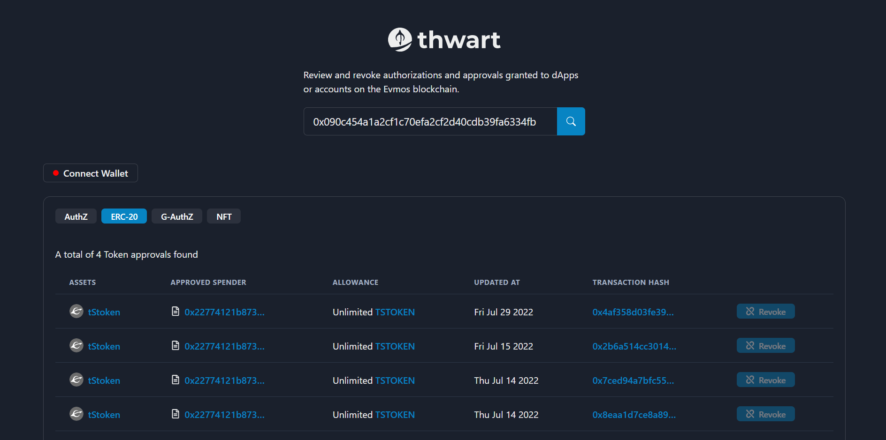

# Thwart Protocol

When users interact with decentralized applications (dApps) like Forge, EvmoSwap, Li.finance, Orbit market, Tofu NFT and the rest, they may be required to grant them permission to spend their tokens and NFTs.

According to the ERC20 and ERC721 standards these are called allowance and approvals respectively. The EVMOS blockchain also recently introduced a new stateful precompile which introduces a new form of allowance called authorization and generic authorization.

If users fail to revoke this authorizations, allowances or approvals, the dApp or spender can continue to spend their tokens even when they no longer interact with the dApp. To help users revoke these authorizations, allowances, and approvals, the Thwart protocol was created.

The Thwart protocol presents an intuitive user interface to view all token approvals and authorizations granted to dApps or accounts on the EVMOS blockchain and offers an easy approach to revoke them. To use Thwart protocol, users will need to connect their wallet to the app. Once their wallet is connected, they can view all of the allowances and approvals that have been granted to their account. They can then revoke any allowances or approvals that they no longer want to be active.

Revoking allowances and approvals is an important security measure. By revoking these permissions, users can help to protect their assets from being stolen. If users are concerned about the security of their assets, they should revoke any allowances and approvals that they no longer need.

To revoke an approval on EVMOS blockchain using Thwart protocol, users will need to follow these steps:

- Go to the Thwart protocol website.
- Click on the "Connect Wallet" button.
- Select your wallet from the list of supported wallets.
- Once your wallet is connected, you will be able to see all of the authorizations, allowances and approvals that have been granted by your account.
- To revoke an allowance or approval, click on the "Revoke" button next to the authorization, allowance or approval that you want to revoke.
- Confirm the transaction in your wallet.

Once users have revoked an authorization, allowance or approval, the dApp or spender will no longer be able to spend their tokens.

Disclaimer: This is a project submission for the EVMOS EVM extension hackathon, all codes have not been fully tested and should not be used in production yet.
